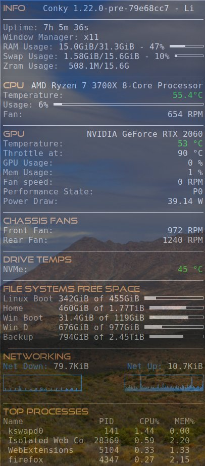

# GadgeteerZA Conky

Conky is a free, light-weight system monitor for X, that displays any kind of information on your desktop. It's official project is at https://github.com/brndnmtthws/conky.

This project shares the Conky code I'm using for my computer's performance stats on the desktop. The screenshot below shows the current setup I have, and I shared a video about my initial install at https://youtu.be/ItZAMXO-FIA, which shows the temperature color automatically changing between red and green depending on whether the temperature value is above or below a certain threshold. In this case I set it to 55 just for illustrative purposes, but you could make that 75 or any other value.

The shared file is normally found on Linux at ~/.config/conky/conky.conf.

# Zram usage display in Conky
I added this line on 17 November 2022. The reason is that the normal swap variables in Conky are read from the '/proc/meminfo' file, but these swap stats appear to only show the uncompressed data used and do not agree at all with the output of the zramctl command.

We can read the formatted output of /sys/block/zram0/mm_stat but the varying whitespace separations really throw things out of alignment (it seems to right aline the columns and adjust spacing). This would have been useful if the bytes returned could have been formatted and calculated, but Conky does not provide this functionality natively.

So working with the zramctl command, I found it has a number of useful options to control the output displayed. You can trim space (using --raw) and also specify no headings, and even specify just a specific column to filter on by providing its name. So using a command such as 'zramctl --raw --noheadings --output TOTAL' will return just the single value for the TOTAL used in Zram.

Again this includes the qualifying suffix, and at differing powers, so we cannot use these outputs to calculate anything useful like a percentage, but for now, the display will at least be tidy, and will make sense.

I've not included a test condition so if you do not use Zram, then you can just comment out that line.