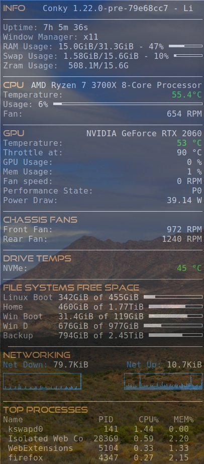

# GadgeteerZA Conky

Conky is a free, light-weight system monitor for X, that displays any kind of information on your desktop. It's official project is at https://github.com/brndnmtthws/conky.

This project shares the Conky code I'm using for my computer's performance stats on the desktop. The screenshot below shows the current setup I have, and I shared a video about my initial install at https://youtu.be/ItZAMXO-FIA, which shows the temperature color automatically changing between red and green depending on whether the temperature value is above or below a certain threshold. In this case I set it to 55 just for illustrative purposes, but you could make that 75 or any other value.

# INSTALLATION
The conky.conf file is normally found on Linux at ~/.config/conky/conky.conf.

The temp_alerts.lua file should go into ~/scripts. This script handles the cooldown (so that it does not announce continuously) and the specific voice. Can run espeak-ng-v en+f2 "System alert. Drive temperature critical." from your terminal to see if espeak installed and hear what it would sound like.

If you see the HDD drive temps then permissions are fine for user to execute sudo commands. Otherwise you need to add your user to the sudoers group.

# Zram usage display in Conky
I added this line on 17 November 2022. The reason is that the normal swap variables in Conky are read from the '/proc/meminfo' file, but these swap stats appear to only show the uncompressed data used and do not agree at all with the output of the zramctl command.

We can read the formatted output of /sys/block/zram0/mm_stat but the varying whitespace separations really throw things out of alignment (it seems to right aline the columns and adjust spacing). This would have been useful if the bytes returned could have been formatted and calculated, but Conky does not provide this functionality natively.

So working with the zramctl command, I found it has a number of useful options to control the output displayed. You can trim space (using --raw) and also specify no headings, and even specify just a specific column to filter on by providing its name. So using a command such as 'zramctl --raw --noheadings --output TOTAL' will return just the single value for the TOTAL used in Zram.

Again this includes the qualifying suffix, and at differing powers, so we cannot use these outputs to calculate anything useful like a percentage, but for now, the display will at least be tidy, and will make sense.

I've not included a test condition so if you do not use Zram, then you can just comment out that line.

# Changes for Nvidia
For some reason the built-in Conky nvidia commands seemed to stop working in 2024. I've switch so long to using the nvidia-smi command instead. Whilst the values display fine, I've not yet found a way to replicate the Nvidia Bar function which used to show a % progress bar for GPU utilisation. This is not ideal but I'm open to ideas. For now at least it all works fine apart from the GPU bars.

# Changes for NVMe drive
I bought a NVMe drive and these can run hot. So I added a section that will run nvme-cli to return the temperate as a numeric value. This will show red if the temp is at 70 C or above, or green if below 70 C.

Note that nvme-cli needs sudo to run, so to get the command running inside Conky without needing the password, you need to allow the command to run without a passwords. To do this:
1. Execute 'sudo visudo' or if you have nano run 'sudo EDITOR=nano visudo'
2. At the bottom of that file add a line 'your_user ALL=(ALL) NOPASSWD: /usr/sbin/nvme' where your_user is your login name.

# Network stats not showing
I noticed my network stats went blank, and it was because the network interface name had changed. You can verify inside the directory /sys/class/net/ what the network interface name is. It may show as enp4s0 or enp5s0, but the lines in the Conky config file need to all referenc ethe correct interface name.

# Massive rewrite on 4 Feb 2026
Netdata highlighted the massive inefficiencies in my Conky config (really bad and wearing my drive out). I used Google Gemini to rewrite most of the core of my config to use memory cache where possible, cut down on repeated queries, and to spread out the queries better. Everything was firing instantly every 3 seconds on the old config. Now some queries are every 10 seconds, some are every minute or 5 minutes. Resource usage should now be a good 70% less.

# Another rewrite on 5 Feb 2026
This adds temperatures for two hard drives in addition to the NVMe drive. The big addition though is adding voice alerts if the temperatures go out of their green zones, using the espeak command. Note the Lua script is required to prevent voice alerts being continuously repeated on refresh.
